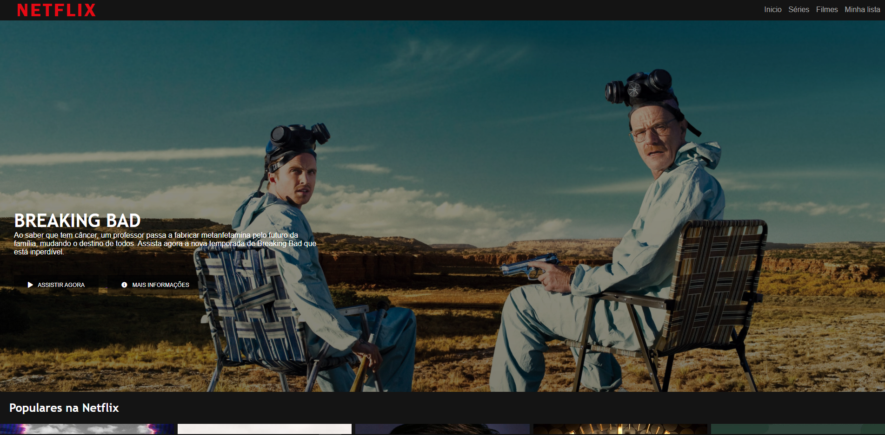
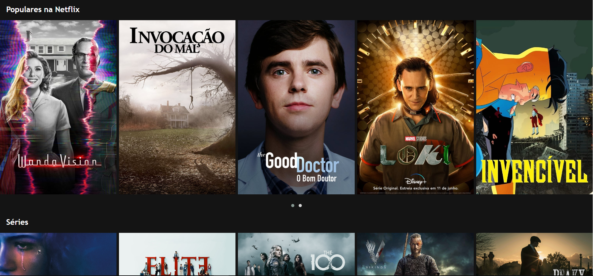

<h1 align="center">
    <a href="index.html">🔗 RECRIANDO A NETFLIX </a>
</h1>

<h3>💻 Sobre o projeto</h3>

Projeto do bootcamp HTML Web Developer da Dio. A proposta é recriar a interface da Netflix
a fim de praticar e aplicar os estudos dados em aula.

<h4 align="center"> 
    🚧  em construção... 🚧
</h4>

<h3>🎨 Layout </h3>

</img>
</img>
</img>

### 🛠 Tecnologias

#### As seguintes ferramentas foram usadas na construção do projeto:

<li> HTML </li>
<li> CSS </li>
<li> JavaScript </li>
<li> <a href="https://owlcarousel2.github.io/OwlCarousel2/"> OwlCarousel </a> </li>
<li> <a href="https://visualstudio.microsoft.com/pt-br/"> Visual Studio </a> </li>
<li> <a href="https://web.digitalinnovation.one/home"> DIO </a> </li>
<li> <a href="https://www.youtube.com/"> YouTube </a> </li>
